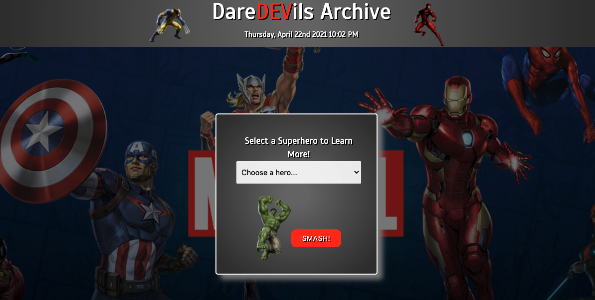
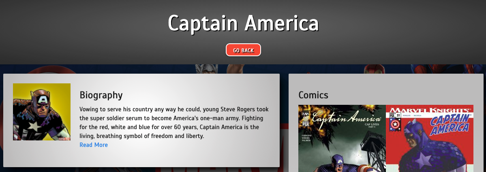

#                DareDEVils Archive

## Developers
- Marla Jane Caram
- Thomas Siopes
- Josh Figuereo
- Alan Balcom

Link to powerpoint presentation: (https://docs.google.com/presentation/d/1Xm67ZkYX-yv3LFSPNopChIwCWVONyd0JIL5US8EmtzE/edit?usp=sharing)
Link to live website: (https://unh-bootcamp-projects.github.io/project-1-group-d/)

## Purpose

The Marvel franchise is globally recognized as the most popular comic story-lines every created. With millions of fans looking to keep up with stories, history, and media appearances, we wanted to create this app to give quick and easy access to fans everywhere to learn more about their favorite characters.

## Technologies Used

- HTML5
- Materialize
- CSS3
- Javascript
- Moment.js
- Marvel API
- OMDB API

## Instructions

Simply choose a character from the dropdown menu and watch as our app takes you to a character page filled with information. You'll be impressing your friends with Marvel knowledge in no time! Such wow!

## Contributing

Pull requests welcomed. For major changes please submit an issue first.

## Issues

We ran into a limitation of the OMDB API where we could only search the API if the hero name matched the name of the title. An example: Guardians of the Galaxy would not show if the user searched Star-Lord. Being able to search the API to find a match in the plot instead of title would have solved this problem.

Couldnt access specific pages of documentation unless google searched it specifically. There was not way to access it through the website normally.
